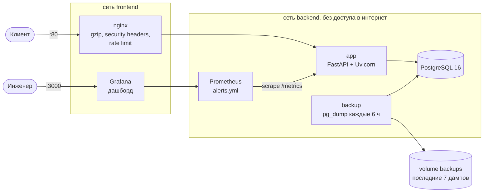

# DevOps service template

Шаблон, показывающий, как довести веб-сервис до состояния «можно запускать в прод»: контейнер, обратный прокси, мониторинг, алерты, бэкапы базы и CI/CD. Само приложение здесь намеренно простое (CRUD «ссылки/заметки» на FastAPI), основная ценность в обвязке вокруг него. Её можно перенести на сервис на любом языке.

## Какие проблемы решает

| Проблема | Что сделано в шаблоне |
|---|---|
| Деплой «руками по SSH», у каждого своя версия окружения | Один `docker compose up`, образ собирается и публикуется в CI, деплой одной кнопкой в GitHub Actions |
| О падении узнают от пользователей | Prometheus + алерты: сервис недоступен, доля 5xx > 5 %, p95 > 500 мс |
| Непонятно, что происходит с сервисом | Дашборд Grafana: RPS, ошибки, задержки, запросы в работе; структурированные JSON-логи с `request_id` |
| Нет бэкапов или они ни разу не восстанавливались | `pg_dump` каждые 6 часов, хранятся последние 7, восстановление одной командой `make restore` |
| Уязвимые зависимости в образе | Сканирование образа Trivy в CI, сборка падает на CRITICAL до публикации образа |
| Сервис «жив», но не работает | Раздельные `/health` (процесс жив) и `/ready` (БД доступна), healthcheck у каждого контейнера, запуск в правильном порядке |

## Архитектура



Наружу опубликованы только два порта: nginx (`80`) и Grafana (`3000`). `/metrics` приложения через nginx недоступен (404), Prometheus забирает метрики напрямую во внутренней сети.

## Быстрый старт

Нужны Docker с плагином compose и `make`.

```bash
git clone <repo-url> && cd devops-service-template
make env    # создаёт .env из .env.example; поменяйте пароли
make up     # собирает образ и поднимает весь стек
```

Проверка:

```bash
curl localhost/health
curl -X POST localhost/api/items -H 'Content-Type: application/json' \
     -d '{"title": "Docker docs", "url": "https://docs.docker.com"}'
curl localhost/api/items
```

- API и Swagger UI: http://localhost/docs
- Grafana: http://localhost:3000 (логин `admin`, пароль `GRAFANA_ADMIN_PASSWORD` из `.env`), дашборд **Service overview** открывается на главной.

`make help` показывает все команды: `up`, `down`, `logs`, `ps`, `test`, `lint`, `fmt`, `backup`, `backups`, `restore`, `clean`.

## Что внутри

```
app/                 FastAPI-приложение
  main.py            фабрика приложения, /health, /ready, /metrics, graceful shutdown
  items.py           CRUD /api/items
  metrics.py         метрики Prometheus и JSON-лог каждого запроса (ASGI middleware)
  config.py          настройки из переменных окружения (pydantic-settings)
migrations/          миграции Alembic (применяются при старте контейнера)
tests/               pytest: CRUD, health/ready, метрики (на SQLite, Docker не нужен)
docker/              entrypoint приложения и скрипт бэкапов
nginx/default.conf   обратный прокси
monitoring/          Prometheus (scrape + алерты) и Grafana (datasource + дашборд)
scripts/restore.sh   восстановление БД из дампа
.github/workflows/   ci.yml (тесты, сборка, сканирование, публикация) и deploy.yml
Dockerfile           multi-stage сборка
docker-compose.yml   весь стек
```

### Приложение

- FastAPI, SQLAlchemy 2, PostgreSQL (psycopg 3), миграции Alembic.
- `GET /health`: liveness, отвечает, пока процесс обслуживает запросы. Используется в `HEALTHCHECK` образа.
- `GET /ready`: readiness, выполняет `SELECT 1`; при недоступной БД отвечает `503`.
- `GET /metrics`: `http_requests_total{method,handler,status}`, гистограмма `http_request_duration_seconds{method,handler}`, `http_requests_in_progress{method}`. В метку `handler` пишется шаблон маршрута (`/api/items/{item_id}`), а не реальный путь, поэтому число временных рядов не растёт от количества записей.
- Логи: одна JSON-строка на событие в stdout, у каждого запроса есть `request_id` (берётся из `X-Request-ID`, его выставляет nginx, и возвращается в ответе).
- Graceful shutdown: uvicorn запущен как PID 1 (`exec` в entrypoint), по `SIGTERM` перестаёт принимать соединения и до 20 секунд дорабатывает текущие запросы, затем закрывает пул соединений с БД. `stop_grace_period: 30s` в compose оставляет на это время.

### Образ

- Multi-stage: зависимости ставятся в virtualenv на стадии сборки, в финальный `python:3.12-slim` копируется только он и код. Компиляторов и pip-кэша в образе нет.
- Непривилегированный пользователь `app` (uid 10001), код принадлежит root и недоступен для записи.
- В compose контейнер приложения запускается с read-only файловой системой, `no-new-privileges` и лимитами CPU/памяти.

### nginx

gzip, заголовки `X-Content-Type-Options`, `X-Frame-Options`, `Referrer-Policy`, `Permissions-Policy`, ограничение 20 запросов/с с одного IP (всплеск до 40, сверх этого `429`), лимит тела запроса 1 МБ, таймауты. Адрес приложения перерезолвится через DNS Docker, поэтому пересоздание контейнера `app` не требует перезапуска nginx. HSTS закомментирован: его стоит включать вместе с TLS.

## Мониторинг и алерты

Prometheus каждые 15 секунд опрашивает приложение и себя. Правила в `monitoring/prometheus/alerts.yml`:

| Алерт | Условие | Длительность |
|---|---|---|
| `InstanceDown` | `up == 0` | 1 мин |
| `HighErrorRate` | доля ответов 5xx > 5 % | 5 мин |
| `HighLatency` | p95 задержки > 500 мс | 5 мин |

Состояние алертов: `docker compose -p devops-template exec prometheus wget -qO- localhost:9090/api/v1/alerts` или страница Alerting в Grafana. Чтобы получать уведомления (Telegram, почта, Slack), добавьте сервис Alertmanager и раскомментируйте блок `alerting` в `prometheus.yml`. В шаблон он не включён, потому что получатели у каждого проекта свои.

Дашборд Grafana (`monitoring/grafana/dashboards/service.json`) подключается автоматически: статус сервиса, RPS по маршрутам и кодам ответа, доля 5xx, задержки p50/p95/p99, запросы в работе. Пороговые линии на графиках совпадают с порогами алертов.

## Бэкапы

Сервис `backup` (образ `postgres:16-alpine`) выполняет `pg_dump -Fc` сразу при старте и затем каждые `BACKUP_INTERVAL_SECONDS` (по умолчанию 6 часов) в volume `backups`. Дамп сначала пишется во временный файл и переименовывается только после успешного завершения, так что битые файлы не попадают в ротацию. Хранятся последние `BACKUP_KEEP` (7) дампов. Healthcheck контейнера становится `unhealthy`, если свежего дампа нет дольше двух интервалов.

```bash
make backup                          # сделать дамп прямо сейчас
make backups                         # список дампов
make restore                         # восстановить последний (спросит подтверждение)
make restore f=app_20260101T000000Z.dump
```

`scripts/restore.sh` останавливает `app`, выполняет `pg_restore --clean --if-exists --single-transaction` (при ошибке база остаётся как была) и запускает `app` снова.

Volume с дампами лежит на том же сервере, что и база. Для настоящей защиты от потери сервера дампы нужно дополнительно копировать наружу (S3, другой сервер), например `rclone` или `restic` по cron.

## CI/CD

`.github/workflows/ci.yml`:

1. На каждый push и pull request: `ruff check`, `ruff format --check`, `pytest`.
2. На push в `main` и теги `vX.Y.Z`: сборка образа (`docker/build-push-action`, кэш слоёв в GitHub Actions), сканирование Trivy (сборка падает при CRITICAL-уязвимостях, для которых есть исправление), публикация в `ghcr.io/<owner>/<repo>`. Теги образа: `latest` (для `main`), `sha-<commit>`, а для релизов `1.2.3` и `1.2`.

Авторизация в GHCR идёт через встроенный `GITHUB_TOKEN`, дополнительных секретов не нужно.

`.github/workflows/deploy.yml` запускается вручную (Actions → Deploy → Run workflow) с выбором тега образа. Он заходит на сервер по SSH и выполняет `docker compose pull app && docker compose up -d`, затем проверяет `/ready`.

| Секрет | Обязательный | Описание |
|---|---|---|
| `SSH_HOST` | да | адрес сервера |
| `SSH_USER` | да | пользователь в группе `docker` |
| `SSH_KEY` | да | приватный ключ для этого пользователя |
| `SSH_PORT` | нет | по умолчанию 22 |
| `SSH_KNOWN_HOSTS` | нет, но желательно | вывод `ssh-keyscan -H <host>`; без него ключ хоста принимается при первом подключении |
| `DEPLOY_PATH` | нет | каталог с `docker-compose.yml` и `.env` на сервере, по умолчанию `~/app` |

Подготовка сервера: установить Docker, скопировать репозиторий в `DEPLOY_PATH`, создать `.env` и указать в нём `APP_IMAGE=ghcr.io/<owner>/<repo>`. Если пакет в GHCR приватный, один раз выполнить `docker login ghcr.io` с токеном с правом `read:packages`. Workflow обновляет только образ: изменения в конфигурации (compose, nginx, алерты) нужно доставить на сервер через `git pull`.

## Как адаптировать под свой проект

1. **Приложение.** Замените `app/` и `Dockerfile` своим сервисом. Чтобы остальное заработало без изменений, сервису нужны:
   - порт `8000`;
   - `GET /health` и `GET /ready`;
   - `GET /metrics` в формате Prometheus с метриками `http_requests_total` и `http_request_duration_seconds` (готовые библиотеки есть для Go, Node.js, Java, .NET). Если имена метрик другие, поправьте `alerts.yml` и дашборд.
2. **Миграции.** Если у вас несколько реплик, задайте `RUN_MIGRATIONS=0` и запускайте миграции отдельной задачей перед деплоем, чтобы реплики не применяли их одновременно.
3. **Домен и TLS.** Поставьте перед nginx Caddy/Traefik с Let's Encrypt или добавьте сертификат в `nginx/default.conf`, затем включите HSTS.
4. **Лимиты.** Подберите `rate`/`burst` в nginx и `deploy.resources.limits` в compose под нагрузку и сервер.
5. **Алерты.** Подключите Alertmanager и получателей; пороги в `alerts.yml` подберите под SLO сервиса.
6. **Бэкапы.** Настройте копирование volume `backups` во внешнее хранилище и периодически проверяйте восстановление (`make restore` на тестовом стенде).

## Локальная разработка

```bash
python3.12 -m venv .venv && . .venv/bin/activate
pip install -r requirements-dev.txt
make lint test
```

Тесты используют SQLite во временном каталоге и не требуют Docker.

## Лицензия

[MIT](LICENSE)
